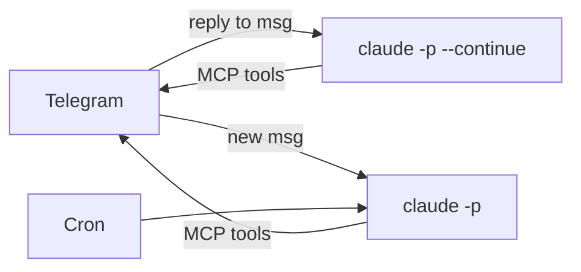
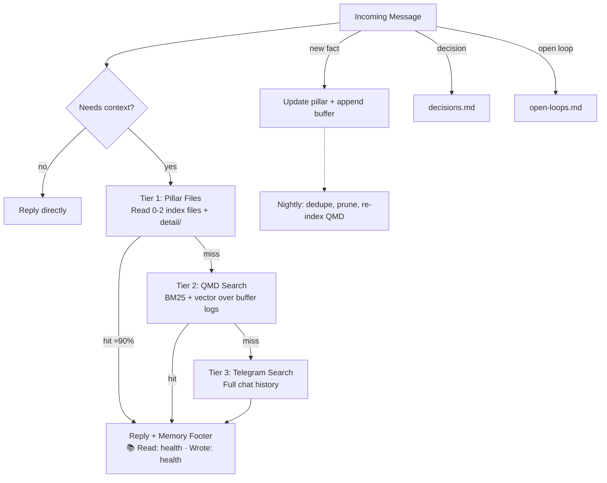

# LeoClaw

A self-extending agent harness built on Claude Code. ~400 lines of plumbing that turns a Mac mini into a personal AI agent you talk to through Telegram.

Named after my dog Leo, my best pal in the world. When I talk to my bot, it feels like talking to my furry bud who's eternally patient and helpful with me. That's the vibe I wanted.

Think [OpenClaw](https://github.com/nichochar/open-claw) but leaner: no SDK, no per-token billing, no framework. Just Claude Code as the runtime and Telegram as the interface.

## What is this?

LeoClaw spawns [Claude Code](https://docs.anthropic.com/en/docs/claude-code) as a child process and lets it do everything. Grammy receives Telegram messages, resumes the right Claude conversation based on threads, and Claude uses MCP tools to reply directly. The harness is plumbing. Claude is the agent.

No SDK. No per-token billing. Flat-rate via your existing Claude Max/Pro subscription and a Mac running 24/7.

## Why?

| | OpenClaw | NanoClaw | **LeoClaw** |
|---|---------|----------|-------------|
| Lines of code | Large | ~5K | ~400 |
| Dependencies | Many | 20+ | 3 |
| Runtime | Custom agent + API | Agent SDK + containers | `claude` CLI |
| Cost | Per-token API | Per-token API / subscription | Max subscription (flat-rate) |
| Skills | Custom format | Custom format | Claude Code native |
| Memory | Custom system | Per-group files | Pillar-based (included) |

Most AI agent frameworks rebuild tool calling, context management, and agentic loops from scratch on top of raw API completions. LeoClaw goes the opposite direction: Claude Code already has a world-class agentic harness with tool calling, skills, MCP plugins, context compaction, and code-quality guarantees. Why rebuild any of that?

**Design goals:**

- **Use Claude Code's built-in agentic harness.** Threading, tool calling, skills, compaction, plugins, coding quality. Don't reinvent what already works.
- **Controllable context window.** Reply to a message and Claude continues that conversation. Send a new message and it starts fresh. No session management, no growing prompts. You naturally control context just by how you use Telegram.
- **Telegram-only communication channel.** One interface, optimized for mobile. No web dashboard, no Slack, no Discord. Just Telegram.
- **Mac mini as hardware.** Physically accessible, always-on, with macOS Keychain for secrets and launchd for process management. No cloud dependencies.
- **Self-extending architecture.** The bot reads its own architecture docs and skill files. It knows how it's built and can add capabilities to itself.

## Architecture



Reply to a message = continue the conversation in the same Claude Code session. Don't reply = fresh session. That's it. Telegram's reply threading becomes your context control. You'll rarely hit compaction because each thread stays focused.

The outer loop is dumb plumbing. All intelligence lives in Claude Code via `CLAUDE.md`, `.claude/skills/`, and your workspace files. Zero agent infrastructure to maintain.

## Quick Start

### Prerequisites

- **macOS** (for Keychain integration; Linux works with env vars instead)
- **Node.js** 20+
- **pnpm** (`npm install -g pnpm`)
- **Claude Code** CLI installed (`npm install -g @anthropic-ai/claude-code`)
- **Claude Max or Pro subscription** (Claude Code requires one)
- **Telegram Bot Token** from [@BotFather](https://t.me/BotFather)

### Setup

```bash
# Clone and install
git clone https://github.com/YOUR_USER/LeoClaw.git
cd LeoClaw
pnpm install

# Configure
cp config.example.json config.json
# Edit config.json: add your Telegram user ID to allowedUsers

# Set up workspace
cp workspace/CLAUDE.md.example workspace/CLAUDE.md
cp workspace/.mcp.json.example workspace/.mcp.json
# Edit workspace/CLAUDE.md: define your bot's identity and behavior

# Build
pnpm build

# Store bot token in Keychain (macOS)
security add-generic-password -a "$USER" -s "leoclaw.telegram_bot_token" -w 'YOUR_BOT_TOKEN' -U

# Run
pnpm start:keychain

# Or run with env var directly
TELEGRAM_BOT_TOKEN=your_token LEO_ALLOWED_USERS=your_telegram_id pnpm start
```

### Development

```bash
pnpm dev  # Watch mode with hot reload
```

### Run as a Service (macOS)

```bash
# Copy and edit the launchd plist
cp ops/launchd/com.leoclaw.bot.plist.example ~/Library/LaunchAgents/com.leoclaw.bot.plist
# Edit: replace YOUR_USER and paths

# Load
launchctl load ~/Library/LaunchAgents/com.leoclaw.bot.plist

# Check logs
tail -f logs/stdout.log
```

## Configuration

| Source | Example | Precedence |
|--------|---------|------------|
| Env var | `TELEGRAM_BOT_TOKEN=xxx` | Highest |
| Env var | `LEO_ALLOWED_USERS=123,456` | Highest |
| Env var | `LEO_WORKSPACE=./workspace` | Highest |
| Env var | `LEO_CLAUDE_PATH=claude` | Highest |
| Env var | `LEO_DANGEROUSLY_SKIP_PERMISSIONS=true` | Highest |
| config.json | `{"allowedUsers": ["123"]}` | Medium |
| Defaults | workspace=repo root, claude=PATH | Lowest |

## Project Structure

```
LeoClaw/
├── src/
│   ├── index.ts              # The harness (~400 lines)
│   └── cron.ts               # Markdown-based cron scheduling
├── packages/
│   └── telegram-mcp/         # MCP server for Telegram Bot API
│       └── src/index.ts      # 7 tools: send, photo, edit, delete, react, typing, ask_user
├── workspace/                # Claude's runtime workspace
│   ├── CLAUDE.md.example     # Bot identity template (copy to CLAUDE.md)
│   ├── ARCHITECTURE.md       # Self-knowledge doc
│   ├── .mcp.json.example     # MCP config template (copy to .mcp.json)
│   ├── .claude/skills/       # Skill definitions
│   │   ├── cron/SKILL.md     # Cron management instructions
│   │   └── memory/SKILL.md   # Memory system example
│   └── crons/                # Cron job definitions
│       └── example.md        # Sample cron job (disabled)
├── ops/launchd/              # macOS service template
├── scripts/                  # Keychain wrapper, git hooks
├── config.example.json       # Config template
├── CLAUDE.md                 # Dev instructions (for working on the harness)
└── .github/workflows/        # Secret scanning CI
```

## Key Concepts

### The Workspace

The `workspace/` directory is where all the intelligence lives. The harness code is just plumbing.

- **`workspace/CLAUDE.md`** — Your bot's identity, personality, rules, and behavior. This is loaded on every Claude invocation. Make it yours.
- **`workspace/ARCHITECTURE.md`** — The bot's self-knowledge. It reads this to understand how it's built, so it can extend itself.
- **`workspace/.mcp.json`** — MCP server configuration. Claude Code auto-loads this.
- **`workspace/.claude/skills/`** — Skill files that teach the bot how to do specific things.

### Skills

Skills are markdown files that teach Claude how to perform specific tasks. No code to compile, no plugins to register. Drop a `SKILL.md` file in `.claude/skills/<name>/` and Claude auto-discovers it.

```
workspace/.claude/skills/
├── memory/           # Pillar-based memory system (included)
├── cron/             # Cron management instructions (included)
├── morning-briefing/ # Daily news digest
├── summarize/        # URL/podcast transcription
├── grok-search/      # Web + X/Twitter search via Grok
└── ...               # Drop in your own
```

**Installing skills:**

```bash
# From skills.sh marketplace or any Claude Code skills registry
npx @anthropic-ai/claude-code skills install <skill-name>

# Or manually: drop a SKILL.md into a new folder
mkdir -p workspace/.claude/skills/my-skill
# Write a SKILL.md with instructions for the capability
```

Want a skill that generates images? Monitors prices? Drafts tweets? Write a SKILL.md describing how, point it at the right APIs, and it works. The bot can also install skills on itself. Ask it to learn something new and it'll create the skill file.

### Memory System

LeoClaw ships with a pillar-based memory architecture that gives your bot persistent, structured memory across conversations. It's implemented entirely as a skill file and workspace conventions. No database, no vector store required.



**How it works:**

```
memory/
  pillars/           # 5 compact index files (~500B-1.5KB each)
    health.md        # Sleep, fitness, medical
    finance.md       # Portfolio, investments
    work.md          # Role, projects, team
    projects.md      # Side projects, tools
    family.md        # People, relationships
  detail/            # Overflow when a pillar grows too large
  buffer/            # Daily append-only audit logs (YYYY-MM-DD.md)
  decisions.md       # Cross-cutting decision log
  open-loops.md      # Active items needing follow-up
```

**Every message, the bot runs two flows:**

1. **Read flow** — Classify the topic, read 0-2 relevant pillar files (they're tiny), follow links to detail files if deeper context is needed. No memory lookup for simple tasks.
2. **Write flow** — New fact learned? Update the pillar file immediately. Append to the daily buffer as an audit log. Decisions go to `decisions.md`, open items to `open-loops.md`.

**Three-tier retrieval when searching:**

| Tier | Tool | When |
|------|------|------|
| 1 | Pillar files | ~90% of queries. Read 0-2 small index files directly. |
| 2 | [QMD](https://github.com/qmdnote/qmd) search | Historical/temporal queries ("when did I last...", "what did we decide about..."). BM25 + vector search across daily buffer files. |
| 3 | Telegram chat search | Last resort. Searches the full chat history when memory files come up empty. |

Most queries never leave Tier 1. QMD handles the "I know we discussed this" cases with local BM25 and vector search over the buffer logs. Telegram search is the nuclear option for when nothing else finds it.

**Key design choices:**
- **Pillar files are the source of truth.** Small, structured, fast to read. Detail files hold overflow.
- **Progressive disclosure.** Claude reads a 500-byte index file, not a 50KB brain dump. Detail files are only loaded when needed.
- **Transparent retrieval.** Every message ends with a footer showing what memory was read and written: `📚 Read: health, finance/portfolio · Wrote: health (sleep -> 7.5h avg)`
- **Self-evolving.** When a topic outgrows existing pillars, the bot proposes a new one. The pillar count isn't fixed.
- **Nightly synthesis.** A cron job deduplicates, prunes stale info, and re-indexes.

**Customizable.** The default five pillars are just a starting point. Tell your bot to add, rename, merge, or remove pillars and it'll restructure on the fly. Want a "travel" pillar? A "reading-list" pillar? Just ask.

The full spec lives in `workspace/.claude/skills/memory/SKILL.md`. Fork it, adapt the pillars to your life, and your bot remembers everything.

### Crons

Scheduled tasks defined as markdown files in `workspace/crons/`. Each file has YAML frontmatter (schedule, timezone, chat_id) and a prompt body.

```markdown
---
schedule: "0 9 * * 1-5"
timezone: America/New_York
chat_id: "YOUR_CHAT_ID"
enabled: true
---

Good morning! Summarize the top 3 Hacker News stories.
```

Telegram commands:
- `/crons` — list all jobs and their next run times
- `/reload_crons` — reload after editing cron files

### Conversations

Context management maps directly to Telegram's UI:

- **Reply to a bot message** → continues the existing Claude session (`--continue`). Full memory of everything said in that thread.
- **Send a new message (no reply)** → starts a fresh Claude session. Clean slate.

That's it. No `/new` command needed, no session tokens, no explicit context management. The way you naturally use Telegram replies becomes your context control. Because threads stay focused on one topic, you'll rarely hit Claude Code's compaction limits.

The harness also walks Telegram reply chains to build thread context, so Claude understands the conversation structure even within a continued session.

### Voice Notes

If you set up an [ElevenLabs](https://elevenlabs.io) API key, voice notes are automatically transcribed using Scribe v2 and processed as text. Optional.

```bash
# macOS Keychain
security add-generic-password -a "$USER" -s "leoclaw.elevenlabs_api_key" -w 'YOUR_KEY' -U

# Or env var
export ELEVENLABS_API_KEY=your_key
```

### Photos

Photos sent to the bot are downloaded, saved to `workspace/tmp/`, and the file path is included in the prompt. Claude can read the image (it's multimodal) and respond accordingly.

### ask_user

The `ask_user` MCP tool lets Claude ask you a question and wait for your reply before continuing. This enables multi-step workflows where Claude needs your input mid-task.

## Telegram Commands

| Command | Description |
|---------|-------------|
| `/new` | Start a fresh session (clears greeting) |
| `/stop` | Abort the currently running Claude process |
| `/crons` | List all cron jobs and their status |
| `/reload_crons` | Reload cron jobs after editing files |

## Extending

The whole point is that the bot can extend itself. Because Claude Code reads the workspace files, you can:

1. **Add skills** — Create `.claude/skills/<name>/SKILL.md` with instructions
2. **Add MCP servers** — Build a new MCP server, add it to `.mcp.json`
3. **Add crons** — Create a `.md` file in `workspace/crons/`
4. **Change behavior** — Edit `workspace/CLAUDE.md`
5. **Add memory** — Implement a memory system via skills and workspace files
6. **Ask the bot to do it** — It reads `ARCHITECTURE.md` and knows how to modify itself

## Security

- **Allowlist** — Only configured Telegram user IDs can interact with the bot
- **Secret scanning** — Pre-commit hooks and CI via gitleaks
- **Keychain** — Bot token and API keys stored in macOS Keychain, not in files
- **Permission mode** — Claude Code runs with default permissions unless you explicitly set `dangerouslySkipPermissions`

## FAQ

**Why not use the Claude API directly?**
Claude Code gives you tool calling, skills, MCP plugins, context compaction, coding ability, and an agentic loop for free. The API gives you raw completions. Claude Code is the better agent harness.

**Why Telegram?**
It's fast, mobile-first, supports rich media, has a good bot API, and reply threading maps naturally to conversation context. One channel, optimized well.

**How does context work?**
Reply to a bot message and it continues the conversation. Send a new message (no reply) and it starts fresh. Telegram's reply threading is the entire context management system. Because threads stay focused, you rarely hit compaction limits.

**Why Mac mini?**
Physical access means you can use Keychain for secrets, launchd for service management, and local tools (browsers, file system, etc.) that cloud VMs can't easily provide. The bot can ask you to physically intervene when needed.

**Can I run this on Linux?**
The harness itself is platform-agnostic. You'd replace Keychain with env vars or a different secret manager, and launchd with systemd. Everything else works as-is.

## Disclaimer

I built this for myself because I wanted more control over my OpenClaw system. It works great for my setup, but it's a personal project first. If you hit bugs, sorry! PRs and issues are welcome.

## License

MIT
