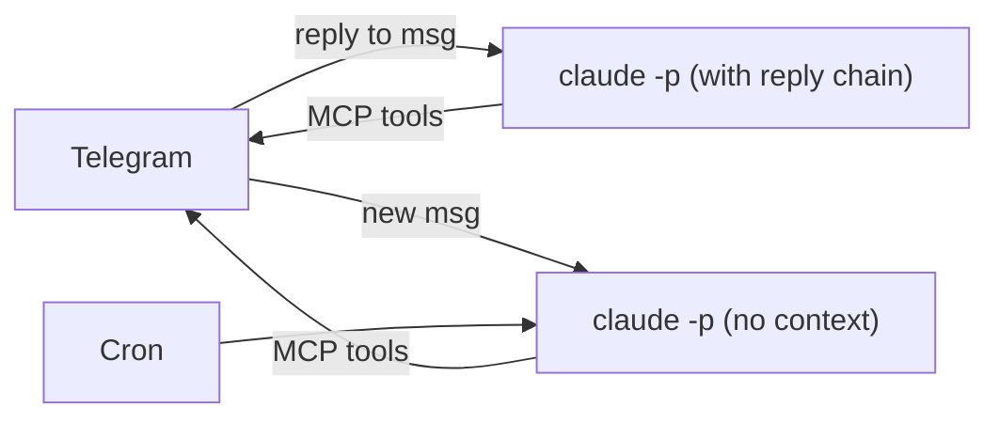
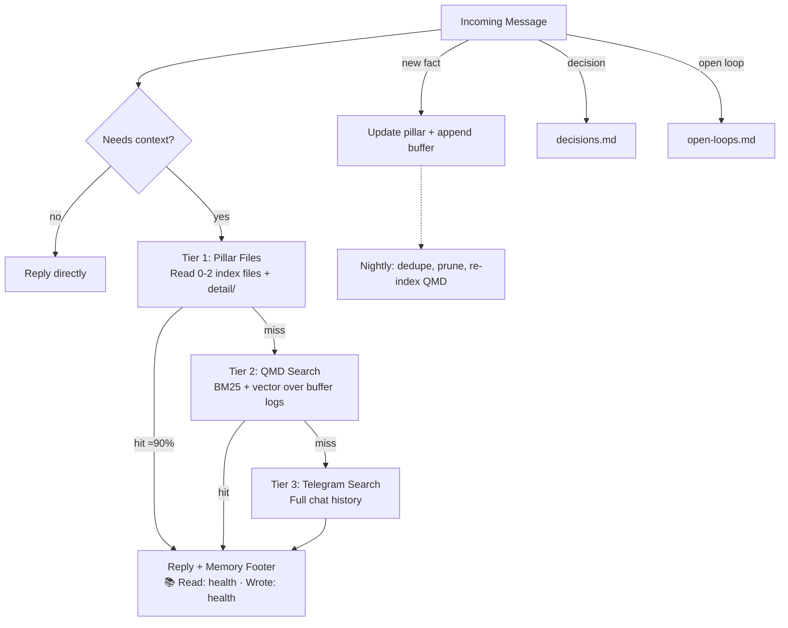

# 🦁 LeoClaw

Thin Telegram bridge to Claude Code. ~100 lines of TypeScript. No SDK, no per-token billing. Flat-rate via your existing Claude Max subscription.

Named after my dog Leo, my best pal in the world. When I talk to my bot, it feels like talking to my furry bud who's eternally patient and helpful with me. That's the vibe I wanted.

## Architecture



Reply to a message = Claude gets the reply chain as context. Don't reply = clean slate. That's it. No commands needed. Each invocation is stateless.

The outer loop is dumb plumbing. All intelligence lives in Claude Code via `CLAUDE.md`, `.claude/skills/`, and your workspace files. Zero agent infrastructure to maintain.

## Why

Different projects, different tradeoffs. LeoClaw bets on Claude Code being the agent so you don't have to build one.

| | OpenClaw | NanoClaw | **LeoClaw** |
|---|---------|----------|-------------|
| Lines of code | Large | ~5K | ~100 |
| Dependencies | Many | 20+ | 3 |
| Runtime | Custom agent + API | Agent SDK + containers | `claude` CLI |
| Cost | Per-token API | Per-token API / subscription | Max subscription (flat-rate) |
| Skills | Custom format | Custom format | Claude Code native |
| Memory | Custom system | Per-group files | Pillar-based (included) |

## Quick Start

```bash
git clone <this-repo>
cd leo
cp config.example.json config.json  # Edit non-secret runtime settings
pnpm install
pnpm dev
```

## Config

```json
{
  "allowedUsers": ["your-telegram-user-id"],
  "workspace": "/path/to/your/workspace",
  "claudePath": "/opt/homebrew/bin/claude",
  "dangerouslySkipPermissions": false
}
```

Runtime precedence is:
1. Environment variables (`LEO_*`, `TELEGRAM_BOT_TOKEN`)
2. `config.json`

Supported environment variables:
- `TELEGRAM_BOT_TOKEN` (required)
- `LEO_ALLOWED_USERS` (comma-separated IDs, e.g. `123,456`)
- `LEO_WORKSPACE`
- `LEO_CLAUDE_PATH`
- `LEO_DANGEROUSLY_SKIP_PERMISSIONS` (`true/false`)

## Secrets (macOS Keychain)

Store secrets in Keychain using the `leoclaw.*` naming convention:

```bash
# Telegram bot token (required)
security add-generic-password -a "$USER" -s "leoclaw.telegram_bot_token" -w "<token>" -U

# Any additional API keys your skills need
security add-generic-password -a "$USER" -s "leoclaw.<service_name>" -w "<key>" -U
```

Skills can read Keychain values in Python via `security find-generic-password -s leoclaw.<service_name> -w`, with env vars taking precedence. OAuth tokens or other read/write credentials that can't live in Keychain go in `secrets/` (gitignored).

Run Leo with the keychain wrapper:

```bash
./scripts/run-leo-with-keychain.sh
```

For launchd, use the template at `ops/launchd/com.leoclaw.bot.plist.example` and point it at `scripts/run-leo-with-keychain.sh`.

## Secret Scanning

Enable local pre-commit secret scanning:

```bash
brew install gitleaks
./scripts/setup-git-hooks.sh
```

CI scanning is enabled via `.github/workflows/secret-scan.yml` using `.gitleaks.toml`.

## Commands

- **Any text** — sent to Claude Code (stateless invocation)
- **Reply to a message** — walks the reply chain for thread context
- `/stop` — kill the running Claude process

## Workspace Structure

```
leoclaw/
├── src/index.ts          # The entire runtime (~100 lines)
├── config.json           # Non-secret runtime settings (gitignored)
├── config.example.json   # Template
└── workspace/            # Claude Code workspace (tracked in this private repo)
    ├── CLAUDE.md         # Identity + context
    ├── .claude/skills/   # Claude Code skills
    ├── memory/           # Daily notes, decisions
    └── .learnings/       # Error logs, feedback
```

The `workspace/` directory is where Claude Code runs. It contains identity, skills, and memory. Photos sent via Telegram are saved to `workspace/tmp/` and are not cleaned up automatically. Add a cron or periodically clear this directory.

### Fork Pattern

```
Public repo (upstream): glue code, README, config template (+ workspace ignored)
Private repo/fork:      + workspace/, config.json, your skills/memory
```

Pull glue code updates from upstream. Your personal stuff never leaves the private fork.

## How It Works

1. **Messages**: Telegram text → spawns `claude -p "prompt"` (stateless). Reply chains provide thread context. No reply = clean slate.
2. **Memory**: Pillar-based system in `workspace/memory/`. Three-tier retrieval (pillar files → QMD search → Telegram search). Nightly synthesis cron keeps it clean.
3. **Skills**: Standard `.claude/skills/` directory. Claude Code reads them automatically.
4. **Crons**: Markdown-based scheduler spawns `claude -p "prompt"` (fresh session). Silent crons suppress stdout fallback to Telegram.

By default, LeoClaw does not pass `--dangerously-skip-permissions`. Set `dangerouslySkipPermissions: true` only if you explicitly need unattended operation (e.g. crons that run shell commands). When enabled, Claude gets unrestricted shell access. Run this on dedicated/isolated hardware, not your daily driver.

## Skills

LeoClaw is extensible through Claude Code's native skill system. Skills are markdown files that live in `workspace/.claude/skills/` and teach the bot new capabilities without touching harness code.

```
workspace/.claude/skills/
├── memory/           # Pillar-based memory system
├── morning-briefing/ # Daily news digest
├── summarize/        # URL/podcast transcription
├── telegram/         # Telegram CLI search & messaging
├── grok-search/      # Web + X/Twitter search via Grok
└── ...               # Drop in your own
```

**Installing skills:**

```bash
# From skills.sh marketplace
npx @anthropic-ai/claude-code skills install <skill-name>

# Or manually: drop a SKILL.md into a new folder
mkdir -p workspace/.claude/skills/my-skill
# Add your SKILL.md with instructions
```

Skills are just instructions. No code to compile, no plugins to register. Claude Code reads them automatically and gains the capability. Want a skill that generates images? Monitors prices? Drafts tweets? Write a SKILL.md describing how, point it at the right APIs, and it works.

## Memory System



LeoClaw ships with a pillar-based memory system out of the box. Instead of dumping everything into one giant context file, memory is organized into small index files ("pillars") covering life domains:

```
memory/pillars/
├── health.md       # Sleep, fitness, medical, supplements
├── finance.md      # Portfolio, investments, crypto
├── work.md         # Role, workstreams, team
├── projects.md     # Side projects, content, tools
└── family.md       # Family, friends, relationships
```

**How it works:**
- On every message, the bot classifies the topic and reads only the 0-2 relevant pillar files. No wasted context.
- New facts get written to the relevant pillar immediately, plus appended to a daily buffer log for audit.
- When a pillar section grows too large, it overflows into `memory/detail/` automatically.
- Every response ends with a transparent footer showing what memory was read and written: `📚 Read: health, work · Wrote: health (added sleep data)`

**Yours to customize.** The five default pillars are a starting point. Rename them, add new ones, merge or remove existing ones. The bot restructures on the fly. Want a "travel" pillar? A "reading-list" pillar? Just tell it.

## Disclaimer

I built this for myself because I wanted more control over my OpenClaw system. It works great for my setup, but it's a personal project first. If you hit bugs, sorry! PRs and issues are welcome.

## License

MIT
